# React Product Listing App

A full-stack e-commerce platform built with React, Node.js/Express, and SQLite.
Complete product management, role-based access control, cart and checkout flows, and order tracking — in a clean, responsive UI.

[](https://reactjs.org/)
[](https://nodejs.org/)
[](https://expressjs.com/)
[](https://sqlite.org/)
[](https://tailwindcss.com/)
[](./LICENSE)

---

## Table of Contents

- [Overview](#overview)
- [Screenshots](#screenshots)
- [Features](#features)
- [Tech Stack](#tech-stack)
- [Architecture](#architecture)
- [Database Schema](#database-schema)
- [API Reference](#api-reference)
- [Getting Started](#getting-started)
- [Roadmap](#roadmap)

---

## Overview

This project demonstrates a complete e-commerce workflow from browsing to order confirmation, with a separate admin panel for full product and category management.

What this project covers:

- Product listing with images, price, description, and category filtering
- User-facing cart, checkout, and order confirmation flow
- Admin panel with full CRUD on products and categories
- File upload handling via Multer
- RESTful backend with clean separation of concerns
- Persistent SQLite storage — zero configuration required

---

## Screenshots

<table>
   <tr>
    <td>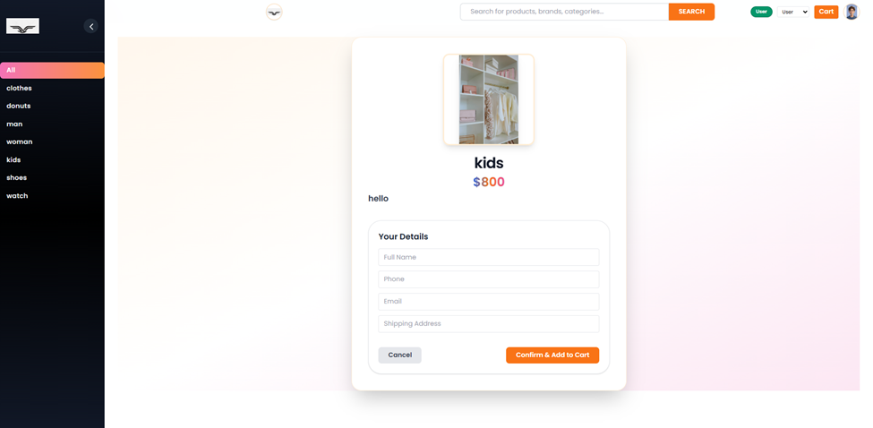</td>

  </tr>
  <tr>
    <td>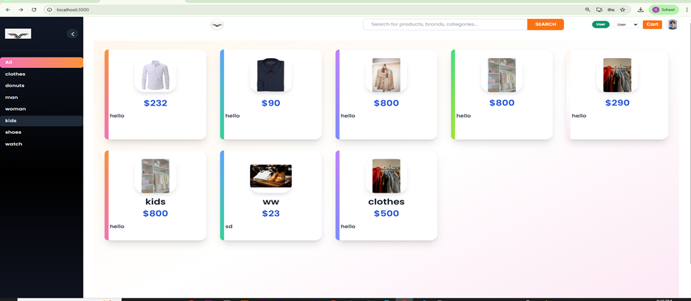</td>
    <td>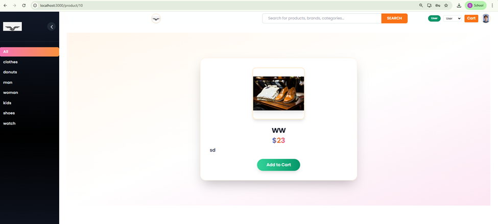</td>
  </tr>
  <tr>
    <td>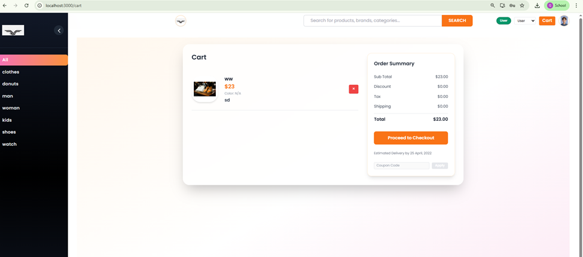</td>
    <td>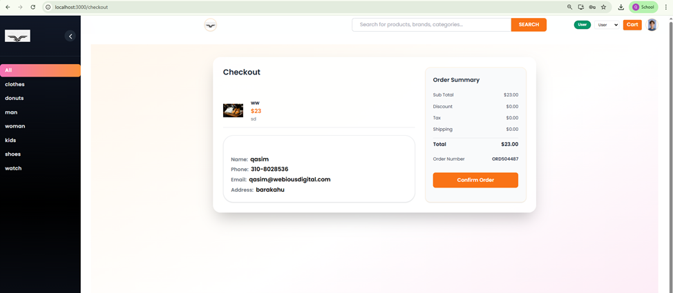</td>
  </tr>
 <tr>
    <td>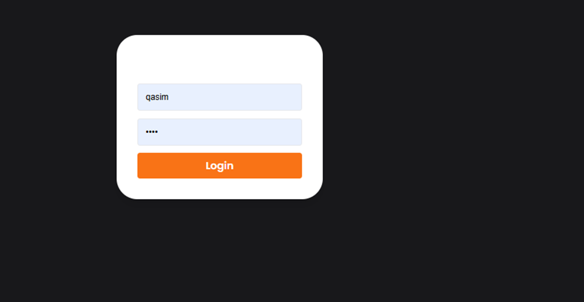</td>
    <td>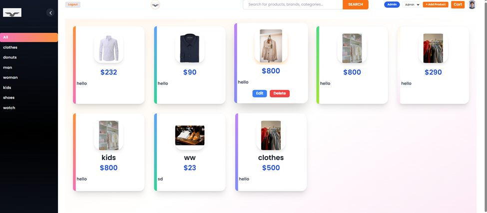</td>
  </tr>
   <tr>
    <td>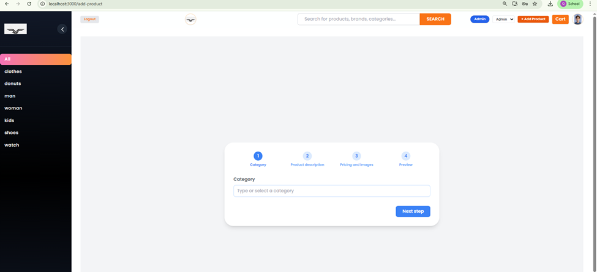</td>
    <td>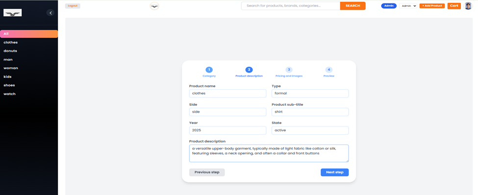</td>
  </tr>
   <tr>
    <td>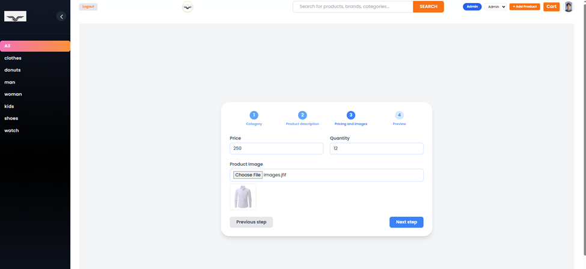</td>
    <td>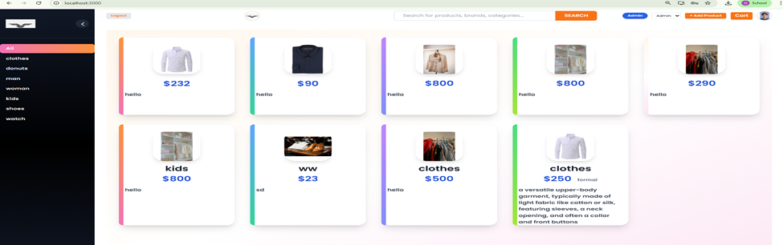</td>
  </tr>
</table>

### User Interface

<table>
  <tr>
    <td align="center" width="50%">
      
      <br /><sub><b>Product Grid with Category Filter</b></sub>
    </td>
    <td align="center" width="50%">
      
      <br /><sub><b>Product Detail Page</b></sub>
    </td>
  </tr>
  <tr>
    <td align="center" width="50%">
      
      <br /><sub><b>Cart Management</b></sub>
    </td>
    <td align="center" width="50%">
      
      <br /><sub><b>Checkout & Order Confirmation</b></sub>
    </td>
  </tr>
</table>

### Admin Panel

<table>
  <tr>
    <td align="center" width="33%">
      
      <br /><sub><b>Admin Login</b></sub>
    </td>
    <td align="center" width="33%">
      
      <br /><sub><b>Product Management</b></sub>
    </td>
    <td align="center" width="33%">
      
      <br /><sub><b>Order Management</b></sub>
    </td>
  </tr>
</table>

---

## Features

### User

- Browse and search products by category
- View full product detail pages
- Add, update, and remove cart items
- Checkout with shipment details
- Order summary and confirmation

### Admin

- Secure admin login (separate from user flow)
- Add, edit, and delete products
- Upload product images
- Manage product categories
- View all customer orders

---

## Tech Stack

| Layer | Technology |
|-------|------------|
| Frontend | React (Class & Functional Components), React Router |
| Styling | Tailwind CSS |
| HTTP Client | Axios |
| Backend | Node.js, Express.js |
| File Uploads | Multer |
| Database | SQLite |

---

## Architecture

```
frontend/                        backend/
├── src/                         ├── server.js
│   ├── App.js                   ├── routes/
│   ├── components/              │   ├── products.js
│   │   ├── Layout.js            │   ├── categories.js
│   │   ├── Sidebar.js           │   ├── orders.js
│   │   ├── ProductGrid.js       │   └── admin.js
│   │   ├── ProductDetail.js     ├── uploads/
│   │   ├── Cart.js              └── products.db
│   │   ├── Checkout.js
│   │   ├── AdminLogin.js
│   │   └── AdminDashboard.js
│   └── index.js
```

### Request Flow

```
Browser
  └── React  (port 3000)
        └── Axios HTTP requests
              └── Express API  (port 5000)
                    ├── SQLite  (products.db)
                    └── /uploads  (static image files)
```

---

## Database Schema

### products

```sql
CREATE TABLE products (
  id          INTEGER PRIMARY KEY AUTOINCREMENT,
  name        TEXT    NOT NULL,
  price       REAL    NOT NULL,
  description TEXT,
  category_id INTEGER REFERENCES categories(id),
  image       TEXT
);
```

### categories

```sql
CREATE TABLE categories (
  id   INTEGER PRIMARY KEY AUTOINCREMENT,
  name TEXT NOT NULL UNIQUE
);
```

### orders

```sql
CREATE TABLE orders (
  id            INTEGER PRIMARY KEY AUTOINCREMENT,
  customer_name TEXT      NOT NULL,
  address       TEXT      NOT NULL,
  total         REAL      NOT NULL,
  created_at    TIMESTAMP DEFAULT CURRENT_TIMESTAMP
);
```

### order_items

```sql
CREATE TABLE order_items (
  id         INTEGER PRIMARY KEY AUTOINCREMENT,
  order_id   INTEGER REFERENCES orders(id),
  product_id INTEGER REFERENCES products(id),
  quantity   INTEGER NOT NULL,
  price      REAL    NOT NULL
);
```

### admins

```sql
CREATE TABLE admins (
  id       INTEGER PRIMARY KEY AUTOINCREMENT,
  username TEXT NOT NULL UNIQUE,
  password TEXT NOT NULL
);
```

---

## API Reference

### Products

| Method | Endpoint | Auth | Description |
|--------|----------|------|-------------|
| GET | `/api/products` | Public | Fetch all products |
| POST | `/api/products` | Admin | Add a new product |
| PUT | `/api/products/:id` | Admin | Update a product |
| DELETE | `/api/products/:id` | Admin | Delete a product |

### Categories

| Method | Endpoint | Auth | Description |
|--------|----------|------|-------------|
| GET | `/api/categories` | Public | Fetch all categories |
| POST | `/api/categories` | Admin | Add a category |
| DELETE | `/api/categories/:id` | Admin | Remove a category |

### Orders

| Method | Endpoint | Auth | Description |
|--------|----------|------|-------------|
| POST | `/api/orders` | Public | Place a new order |
| GET | `/api/orders` | Admin | View all orders |

### Auth & Upload

| Method | Endpoint | Description |
|--------|----------|-------------|
| POST | `/api/admin-login` | Admin login |
| POST | `/api/upload` | Upload product image |

---

## Getting Started

### Prerequisites

- Node.js v14+
- npm

### Backend

```bash
cd backend
npm install
node server.js
```

Runs at `http://localhost:5000`

### Frontend

```bash
cd frontend
npm install
npm start
```

Runs at `http://localhost:3000`

### Default Admin Credentials

```
Username: admin
Password: admin123
```

> Change these in the `admins` table before any public deployment.

---

## Roadmap

- [ ] JWT-based authentication for users and admins
- [ ] User accounts with order history
- [ ] Payment gateway (Stripe)
- [ ] Pagination and advanced product filtering
- [ ] Cloud image storage (Cloudinary / S3)
- [ ] Order status tracking (Pending / Shipped / Delivered)
- [ ] Deployed demo (Vercel + Railway)

---

## License

MIT — see [LICENSE](./LICENSE) for details.
